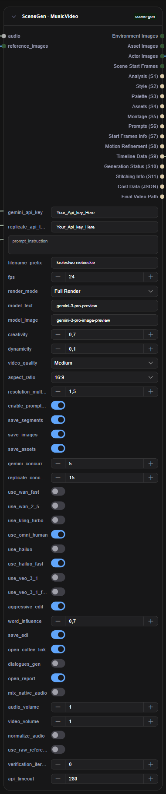
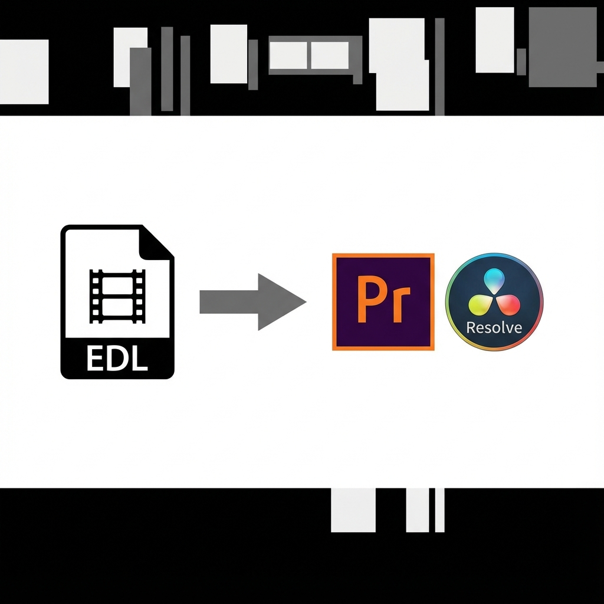

# Scene Gen Node for ComfyUI

[English](#english) | [Polski](#polski)

---

<a name="english"></a>
## 🇬🇧 English

**Scene Gen** is a powerful custom node for ComfyUI that automates the creation of music videos and visual scenes directly from audio input.



[](https://youtu.be/seNjjavfd7k)

It leverages the power of **Google Gemini 3 Pro** for deep audio analysis, scriptwriting, and asset generation, and integrates with **Replicate** to generate high-quality video clips using state-of-the-art models like Wan, Kling, Hailuo, and Veo.

### ✨ Key Features

*   **🎵 Deep Audio Analysis**: Uses Gemini to analyze your audio's genre, mood, lyrics, and dramatic structure to perfectly sync visuals with the music.
*   **🎨 Automated Art Direction**: Automatically generates a cohesive visual style, color palette, and lighting mood based on the track's vibe.
*   **🌌 Diverse Styles**: Create anything from cinematic realism to [LoFi SciFi](https://www.youtube.com/shorts/8rwUUHLk-pc), anime, or abstract art.
*   **🖼️ Asset & Character Generation**: Creates consistent environments, props, vehicle interiors, and characters (actors) before filming begins. Supports comprehensive character sheets and clean prop generation.
*   **🎬 Intelligent Montage**: Constructs a video timeline (montage) that fits the song's duration, with cuts synchronized to beats and dramatic shifts.
*   **🎥 Multi-Model Video Generation**: Supports a wide range of top-tier video models via Replicate:
    *   **Wan 2.5** (Standard & Fast)
    *   **Kling v2.5 Turbo**
    *   **Hailuo 2.3** (Standard & Fast)
    *   **Google Veo 3.1** (Standard & Fast)
    *   **OmniHuman**
*   **🎞️ Auto-Editing**: Automatically stitches generated clips together and muxes them with your original audio.
*   **📝 EDL Export**: Exports a CMX 3600 `.edl` file with audio tracks, allowing you to import the timeline into Premiere Pro or DaVinci Resolve for fine-tuning.
    
    
*   **🎛️ Granular Control**: Sliders for Creativity, Dynamicity, and Word Influence (Lyric literalism).

### 🛠️ Installation

1.  **Clone the Repository**:
    Navigate to your ComfyUI `custom_nodes` directory and clone this repo:
    ```bash
    cd ComfyUI/custom_nodes
    git clone https://github.com/lazniak/scene_gen.git
    ```

2.  **Install Dependencies**:
    ```bash
    cd scene_gen
    pip install -r requirements.txt
    ```
    *(Note: Ensure you are in your ComfyUI python environment)*

3.  **Restart ComfyUI**.

### ⚙️ Configuration & API Keys

This node requires API keys for the services it uses. You can enter them directly into the node inputs.

*   **Google Gemini API Key**: Get it from [Google AI Studio](https://aistudio.google.com/).
*   **Replicate API Token**: Get it from [Replicate](https://replicate.com/account/api-tokens).

### 🚀 Usage

1.  **Select a Node**: Right-click in ComfyUI -> `SceneGen` -> `MusicVideo` -> `SceneGen - MusicVideo` OR `SceneGen` -> `Movies` -> `SceneGen - Movies`.
    *   **MusicVideo**: Best for music videos, syncing visuals to beats and lyrics.
    *   **Movies**: Best for narrative storytelling, dialogue, and script-based content.
2.  **Connect Audio**: Load your audio file using a standard `Load Audio` node and connect it to the `audio` input.
3.  **Enter API Keys**: Paste your Gemini and Replicate keys.
4.  **Set Instructions**: In `prompt_instruction`, describe what you want to see (e.g., "A futuristic cyberpunk chase", "A calm nature documentary").
5.  **Select Models**: Enable the video models you want the AI to choose from (Wan, Kling, Veo, etc.).
6.  **Run**: Queue the prompt. The node will go through 11 stages of production, from analysis to final rendering.

### 🎚️ Parameters Explained

*   **`creativity`**: (0.0 - 1.0) How much the AI should hallucinate or add details not explicitly requested.
*   **`dynamicity`**: (0.0 - 1.0) Controls the pacing. 0 is slow and contemplative; 1 is fast-paced action.
*   **`word_influence`**: (-1.0 to 1.0)
    *   `1.0`: Literal interpretation of lyrics (e.g., lyric "fire" shows fire).
    *   `-1.0`: Abstract vibe interpretation, ignoring literal lyrics.
    *   `0.0`: Balanced approach.
*   **`aggressive_edit`**: If `True`, forces cuts strictly on beats and may generate more footage than needed to ensure perfect sync.
*   **`save_segments`**: Save individual raw video clips from Replicate.
*   **`save_edl`**: Generate an Edit Decision List for external video editors.
*   **`use_raw_references`**: If `True`, the system will NOT generate AI assets for items that match the names of your provided reference images. It allows you to fully control specific characters or props by uploading your own images.
*   **`verification_iterations`**: (0-3) Number of verification passes to refine start frames against references. Higher values improve consistency with reference assets but increase generation time.

### 🎬 Preview Player

The built-in preview player appears in the live HTML report and allows you to:
- Preview the video montage before full render
- See synchronized slideshow of start frames
- Scrub through the timeline
- Plays in sync with audio based on montage timing


### 📂 Outputs

*   **Images**: Returns tensors for generated Environments, Assets, Actors, and Scene Start Frames.
*   **Debug Strings**: JSON outputs for every stage (Analysis, Style, Montage, Prompts) to help you understand what the AI did.
*   **Final Video Path**: The absolute path to the finished `.mp4` file.

---

<a name="polski"></a>
## 🇵🇱 Polski

**Scene Gen** to zaawansowany węzeł (node) dla ComfyUI, który automatyzuje tworzenie teledysków i scen wideo bezpośrednio z pliku audio.


[](https://www.youtube.com/shorts/wtxXUM1-4F8)

Wykorzystuje moc **Google Gemini 3 Pro** do głębokiej analizy dźwięku, pisania scenariuszy i generowania zasobów, oraz integruje się z **Replicate**, aby tworzyć wysokiej jakości klipy wideo przy użyciu najnowszych modeli, takich jak Wan, Kling, Hailuo czy Veo.

### ✨ Główne Funkcje

*   **🎵 Głęboka Analiza Audio**: Używa Gemini do analizy gatunku, nastroju, tekstu piosenki i struktury dramatycznej, aby idealnie zsynchronizować obraz z muzyką.
*   **🎨 Automatyczna Dyrekcja Artystyczna**: Samodzielnie definiuje spójny styl wizualny, paletę kolorów i oświetlenie na podstawie klimatu utworu.
*   **🌌 Różnorodne Style**: Twórz wszystko, od kinowego realizmu po [LoFi SciFi](https://www.youtube.com/shorts/8rwUUHLk-pc), anime czy sztukę abstrakcyjną.
*   **🖼️ Generowanie Zasobów**: Tworzy spójne środowiska, rekwizyty, wnętrza pojazdów i postacie (aktorów) przed rozpoczęciem "kręcenia". Obsługuje szczegółowe karty postaci i czyste generowanie rekwizytów.
*   **🎬 Inteligentny Montaż**: Buduje oś czasu wideo (montaż) dopasowaną do długości utworu, z cięciami zsynchronizowanymi z rytmem i zmianami nastroju.
*   **🎥 Obsługa Wielu Modeli Wideo**: Wspiera szeroką gamę topowych modeli poprzez Replicate:
    *   **Wan 2.5** (Standard & Fast)
    *   **Kling v2.5 Turbo**
    *   **Hailuo 2.3** (Standard & Fast)
    *   **Google Veo 3.1** (Standard & Fast)
    *   **OmniHuman**
*   **🎞️ Auto-Edycja**: Automatycznie łączy wygenerowane klipy i miksuje je z oryginalnym dźwiękiem.
*   **📝 Eksport EDL**: Eksportuje plik `.edl` (CMX 3600) ze ścieżkami audio, umożliwiając import osi czasu do Premiere Pro lub DaVinci Resolve w celu dalszej edycji.
    
    
*   **🎛️ Precyzyjna Kontrola**: Suwaki do sterowania Kreatywnością, Dynamiką i Wpływem Słów (dosłowność tekstu).

### 🛠️ Instalacja

1.  **Sklonuj Repozytorium**:
    Przejdź do katalogu `custom_nodes` w ComfyUI i sklonuj to repozytorium:
    ```bash
    cd ComfyUI/custom_nodes
    git clone https://github.com/lazniak/scene_gen.git
    ```

2.  **Zainstaluj Zależności**:
    ```bash
    cd scene_gen
    pip install -r requirements.txt
    ```
    *(Uwaga: Upewnij się, że używasz środowiska Python powiązanego z ComfyUI)*

3.  **Zrestartuj ComfyUI**.

### ⚙️ Konfiguracja i Klucze API

Ten węzeł wymaga kluczy API do serwisów zewnętrznych. Możesz je wprowadzić bezpośrednio w polach wejściowych węzła.

*   **Google Gemini API Key**: Pobierz z [Google AI Studio](https://aistudio.google.com/).
*   **Replicate API Token**: Pobierz z [Replicate](https://replicate.com/account/api-tokens).

### 🚀 Użycie

1.  **Wybierz Węzeł**: Kliknij prawym przyciskiem w ComfyUI -> `SceneGen` -> `MusicVideo` -> `SceneGen - MusicVideo` LUB `SceneGen` -> `Movies` -> `SceneGen - Movies`.
    *   **MusicVideo**: Najlepszy do teledysków, synchronizacji z bitem i tekstem piosenki.
    *   **Movies**: Najlepszy do opowiadania historii, dialogów i treści opartych na scenariuszu.
2.  **Podłącz Audio**: Załaduj plik audio używając standardowego węzła `Load Audio` i podłącz go do wejścia `audio`.
3.  **Wprowadź Klucze**: Wklej swoje klucze Gemini i Replicate.
4.  **Ustaw Instrukcje**: W polu `prompt_instruction` opisz, co chcesz zobaczyć (np. "Futurystyczny pościg w cyberpunku", "Spokojny dokument przyrodniczy").
5.  **Wybierz Modele**: Włącz modele wideo, z których AI ma korzystać (Wan, Kling, Veo itp.).
6.  **Uruchom**: Zakolejkuj prompt. Węzeł przejdzie przez 11 etapów produkcji, od analizy po finalny render.

### 🎚️ Wyjaśnienie Parametrów

*   **`creativity`**: (0.0 - 1.0) Jak bardzo AI może "halucynować" lub dodawać szczegóły nieopisane w instrukcji.
*   **`dynamicity`**: (0.0 - 1.0) Kontroluje tempo. 0 to powolne, kontemplacyjne ujęcia; 1 to szybka akcja.
*   **`word_influence`**: (-1.0 do 1.0)
    *   `1.0`: Dosłowna interpretacja tekstu piosenki (np. słowo "ogień" pokazuje ogień).
    *   `-1.0`: Abstrakcyjna interpretacja klimatu, ignorowanie dosłownego tekstu.
    *   `0.0`: Podejście zrównoważone.
*   **`aggressive_edit`**: Jeśli `True`, wymusza cięcia idealnie na bitach i może generować więcej materiału niż potrzeba, aby zapewnić idealną synchronizację (przycinanie klipów).
*   **`save_segments`**: Zapisuje pojedyncze surowe klipy wideo z Replicate.
*   **`save_edl`**: Generuje listę decyzji edycyjnych (EDL) dla zewnętrznych programów montażowych.
*   **`use_raw_references`**: Jeśli `True`, system NIE wygeneruje zasobów AI dla elementów, które pasują nazwą do dostarczonych obrazów referencyjnych. Pozwala to na pełną kontrolę nad konkretnymi postaciami lub rekwizytami poprzez wgranie własnych grafik.
*   **`verification_iterations`**: (0-3) Liczba iteracji weryfikacji klatek startowych względem referencji. Wyższe wartości poprawiają spójność z assetami referencyjnymi, ale wydłużają czas generowania.

### 🎬 Odtwarzacz Preview

Wbudowany odtwarzacz pojawia się w raporcie HTML i pozwala na:
- Podgląd montażu wideo przed pełnym renderem
- Zsynchronizowany pokaz slajdów klatek startowych
- Przesuwanie po osi czasu
- Odtwarzanie zsynchronizowane z audio według timingu montażu


### 📂 Wyjścia (Outputs)

*   **Images**: Zwraca tensory obrazów dla wygenerowanych Środowisk, Zasobów, Aktorów i Klatek Startowych Scen.
*   **Debug Strings**: Wyjścia JSON dla każdego etapu (Analiza, Styl, Montaż, Prompty), pomagające zrozumieć proces decyzyjny AI.
*   **Final Video Path**: Ścieżka absolutna do gotowego pliku `.mp4`.
